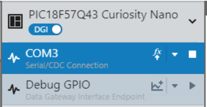
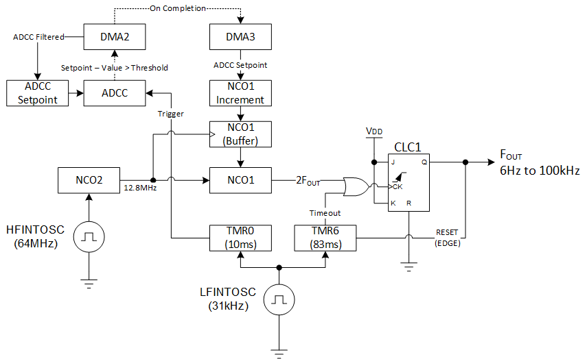

<!-- Please do not change this logo with link -->

# Voltage-to-Frequency and Frequency-to-Voltage Converter with PIC18F57Q43

Using the peripherals in the PIC18F57Q43 microcontroller, a voltage-to-frequency (V/F) and frequency-to-voltage (F/V) converter can be created using no external components. Both examples operate core independently on the same microcontroller.

This code example uses the Numerically Controlled Oscillator (NCO), the Signal Measurement Timer (SMT), UART, Direct Memory Access (DMA), Digital-to-Analog Converter (DAC), Analog-to-Digital Converter with Computation (ADCC), TMR0, TMR2/TMR4/TMR6 and Configurable Logic Cell (CLC) peripherals.

## Related Documentation

- [PIC18F57Q43 Device Homepage](https://www.microchip.com/wwwproducts/en/PIC18F57Q43?utm_source=GitHub&utm_medium=TextLink&utm_campaign=MCU8_MMTCha_PIC18FQ43&utm_content=pic18q43_v_to_f_github)

## Software Used

- [MPLAB® X IDE v5.45 or newer](https://www.microchip.com/en-us/development-tools-tools-and-software/mplab-x-ide?utm_source=GitHub&utm_medium=TextLink&utm_campaign=MCU8_MMTCha_PIC18FQ43&utm_content=pic18q43_v_to_f_github)
- [XC8 v2.31 or newer](https://www.microchip.com/en-us/development-tools-tools-and-software/mplab-xc-compilers?utm_source=GitHub&utm_medium=TextLink&utm_campaign=MCU8_MMTCha_PIC18FQ43&utm_content=pic18q43_v_to_f_github)
- [MPLAB Code Configurator (MCC) v4.0.2](https://www.microchip.com/mplab/mplab-code-configurator?utm_source=GitHub&utm_medium=TextLink&utm_campaign=MCU8_MMTCha_PIC18FQ43&utm_content=pic18q43_v_to_f_github)
- [PIC18F-Q DFP v1.9.175](https://packs.download.microchip.com/)
- [MPLAB Data Visualizer Plugin](https://www.microchip.com/en-us/development-tools-tools-and-software/embedded-software-center/mplab-data-visualizer?utm_source=GitHub&utm_medium=TextLink&utm_campaign=MCU8_MMTCha_PIC18FQ43&utm_content=pic18q43_v_to_f_github)

## Hardware Used

- [PIC18F57Q43 Curiosity Nano (P/N: DM164150)](https://www.microchip.com/developmenttools/ProductDetails/DM164150?utm_source=GitHub&utm_medium=TextLink&utm_campaign=MCU8_MMTCha_PIC18FQ43&utm_content=pic18q43_v_to_f_github)   
- Breadboard

Depending on the example, you will either need:

- Power Supply or Potentiometer (for using the V/F to generate the waveform)
- Function Generator (for using the F/V to generate the analog output)

*If the combined example is run, only 1 of these is required, as the output can be looped back into the other.*

For evaluating the performance independently of the microcontroller (*optional*), you will also need:

- A Digital Multimeter
- Oscilloscope (recommended: 10x probe)

The following table summarizes the pin assignments in this code example:

| Pin | Function          | Application          |
| --- | ----------------- | -------------------- |
| RA0 | Analog Input      | Voltage to Frequency |
| RA7 | Frequency Output  | Voltage to Frequency |
| RA5 | Frequency Input   | Frequency to Voltage |
| RA2 | Analog Output     | Frequency to Voltage |
| RF0 | UART TX           | Both                 |
| RF1 | UART RX           | Both                 |  

### Setting Up the Potentiometer

To use a potentiometer as the voltage source, you will have to build the following circuit:

**Potentiometer Connection Diagram**  
  

**Example Setup. Shown with V/F supplying F/V.**  
  

*Important! The acquisition time of the ADCC has to be adjusted depending on the impedance of the potentiometer!* The worst-case equivalent impedance for the potentiometer is at the 50% position. At this point, the equivalent impedance (of the circuit) is 50% of the potentiometer value.

### Setting MPLAB Data Visualizer

*Note: If MPLAB Data Visualizer isn't installed, no icon will appear in the toolbar. (This example uses the plugin version for MPLAB X IDE). MPLAB Data Visualizer can be downloaded using this [link](https://www.microchip.com/en-us/development-tools-tools-and-software/embedded-software-center/mplab-data-visualizer?utm_source=GitHub&utm_medium=TextLink&utm_campaign=MCU8_MMTCha_PIC18FQ43&utm_content=pic18q43_v_to_f_github).*

1. Click on the MPLAB Data Visualizer icon in the toolbar.  
  
2. Select the COM port of the Curiosity Nano (but do not connect to it).  
  
3. Set the baud rate to 115200, 8-bits, and no parity.  
  
4. Connect to the Curiosity Nano.  
  
5. Select it as the terminal source.  
  
6. Text should start appearing in the terminal shortly.   
  

## Theory of Operation

### Voltage-to-Frequency (V/F)

**Block Diagram of the V/F Converter (for reference)**  
  

#### Generating the Output

NCO1 acts as the frequency synthesizer in this example. The NCOs use a 20-bit word for incrementing the frequency. The smaller the word is, the lower the jitter for non-integer frequencies of the NCO. One problem that arises from the frequency output is the duty cycle. To get a 50% duty cycle, then the NCO output frequency must be doubled.

#### Doubling the Frequency

Doubling the frequency is equivalent to left-shifting the result by 1 bit. However, the ADCC does not have the ability to left-shift results, only right-shift. However, if the ADCC oversamples, and the input remains constant, then the ADCC can effectively left-shift the result. However, the results will fall on a bell-curve due to random noise that is summed together.

**Error at 4 samples, shown with a 50/50 chance for the last bit to be 1 or 0. (Example only)**  
  

The ADCC samples 16 times back-to-back, then right-shifts by 2 to reduce noise. This is an effective left-shift of 2 bits. To reduce jitter caused by the slight statistical variations, the computation feature of the ADCC was used to filter the results. Only results with a change in value greater than a set threshold (in this case, +4 or -4 bits) would trigger the DMA to update the reference level (DMA2), then incremented value (DMA3).

*Note: Thresholds and AQ time may need to be adjusted depending on the noise level of the input signal.*

#### Creating the Base Frequency

To correctly output 100kHz at the maximum value (0xFFF), NCO1 uses a base clock of 12.8MHz. This frequency can be externally supplied, however NCO2 on the microcontroller can be used to create this frequency.

(Note: NCO2 can be replaced or changed to modify the output frequency.)

NCO2 runs from the High-Frequency Internal Oscillator (HFINTOSC) running at the maximum frequency of 64MHz. Using a slower input clock is possible, however the faster the NCO is clocked, the less jitter there will be in the output frequency.

#### Generating the Output

One issue that occurred during development was the output occasionally getting stuck at 1 when transitioning to a DC output. This is due to the CLC receiving an odd number of pulses, and with an increment of 0, the NCO cannot rollover to generate a new one.

One of the advantages of using a CLC (rather than the NCO) to generate the 50% duty cycle is the extra logic options available. The CLC is implemented as a `JK Flip-Flop with Reset`. J and K are held at logic HIGH so the output toggles on every clock cycle. The clock input is from NCO1 (at twice the desired output frequency).

TMR6 is used to help control the output waveform. It can be used in 2 ways - it can either be used to produce a DC output or it can be used to produce a low-frequency (6 Hz) output.

#### Low-Frequency Output (6 Hz)

The benefit of the low-frequency output is that a broken connection from the V/F converter can be detected, since the output is always oscillating.

The downside of this approach is that the F/V converter counts the low-frequency pulses, producing the occasional glitch. (At 6 Hz, a ***small*** (DAC value of 1) glitch would occur every 65s).

The CLC setup in this example is shown below.

*Note: This is the default configuration of this example.*

**Implementation of the Duty Cycle Generator (CLC1)**

  

#### DC Output (0 Hz)

The benefit of the DC output is that the F/V converter considers this to be a true-zero output, as there are no pulses to count. TMR6 is used in this mode to ensure that the CLC is at a logic LOW - if an odd number of pulses are latched when the NCO is set to 0, then the CLC will be stuck HIGH.

The downside of this approach is that an open wire between the two cannot be detected by pulse detection. The pulse detector is implemented by the CPU, which polls the SMT once per second when it goes to print the debug values.

The setup of the CLC is shown below.

**Alternative Implementation of the Duty Cycle Generator (CLC1)**  
  

### Frequency-to-Voltage (F/V)

**Block Diagram of the F/V Converter**  
  

#### Frequency Counting

The TMR4 peripheral is used in this example as a frequency counter. Every rising edge from NCO3 causes it to count by 1. The falling edge from TMR2 resets the TMR4 counter back to 0.

*Note: If more than 255 pulses occur, then TMR4 will rollover to 0x00. (In my limited testing, this occurred around 102kHz). However, this may vary depending on the exact frequency of LFINTOSC.*

#### Clock Division

To count the pulses using an 8-bit timer, the input signal is divided by NCO3. NCO3 effectively divides the signal by 392. This allows the 8-bit timer to capture 255 pulses at ~100kHz.

*Note: Due to fractional errors, it is not exactly 255 at 100kHz.*

#### CLC Passthrough

CLC2 is used as a digital pass-through for more flexibility in selecting an I/O pin. From CLC2, it is distributed to the SMT (for debug printing) and to NCO3.

#### Debug Printing and Measurement

Originally, the SMT was used as the measurement timer in this example, however it required the CPU to manually convert the frequency to the appropriate voltage. With the clock divider approach, the SMT is no longer a required peripheral, however it can be used to measure the input frequency to print to the UART.

#### Loading the DAC

To transfer the new DAC value into the DAC, DMA1 is triggered by the rising edge of TMR2 to move the TMR4 count to the DAC Data Register.

## Jitter, Error, and Limitations

### Jitter in the NCOs

One of the challenges with the digital approach to creating these examples is jitter in the output. The NCOs count to 220 and carryover any remainder from the increment (e.g.: 220 + 50 = 50). Some output frequencies will carryover enough of a remainder that the NCO rollover occurs earlier than expected, causing jitter in the output.

One way to counteract jitter is to increase the input clock frequency of the NCO. The smaller the increment, the lower the jitter is.

### Low Frequency Error in F/V

One of issue with the F/V converter is the performance at low frequencies. Low-frequencies trigger the same issue as *Jitter in the NCOs*. If a low-frequency signal is passed in, the NCO may rollover unevenly or after multiple seconds. This primarily affects the resolution of the F/V converter at low-frequencies. Figure 5 (below) shows an example of a low-frequency input causing instability in the output.

**Instability in the F/V Converter**  
  

### Analog Limitations

The DAC on the PIC18-Q43 family of microcontrollers has a resolution of 8-bits. While it is possible for the microcontroller to resolve the frequency to a higher resolution with the SMT, this program cannot output more than 8-bits of resolution using the internal DAC.

(It is possible to use an external DAC with more output resolution, however the program will need to be modified.)

## Summary
This example shows how the rich set of peripherals in the PIC18-Q43 family of microcontrollers can be used to create a frequency-to-voltage and a voltage-to-frequency converter.
